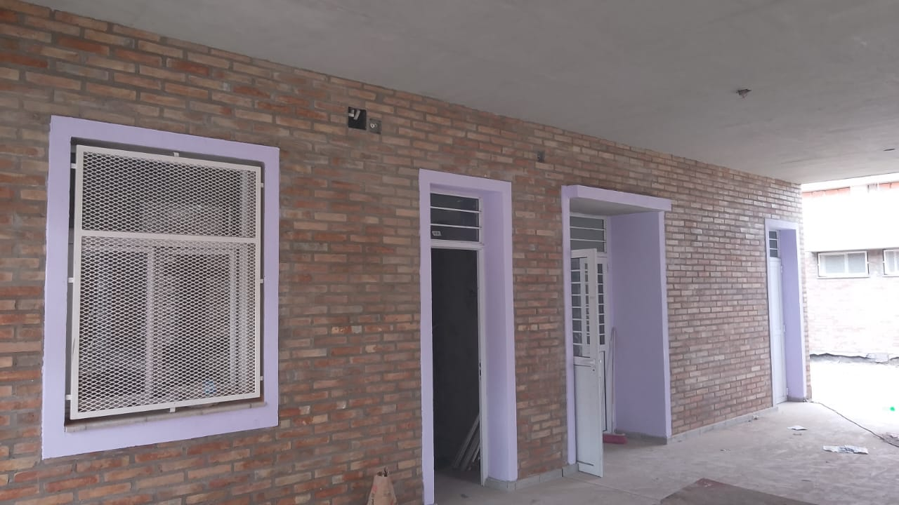
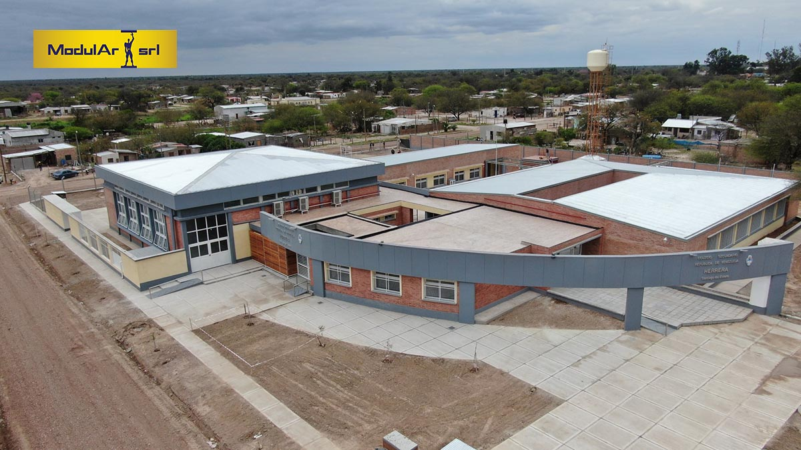

```{r setup, include=FALSE}
library(flexdashboard)
```

# Avances

```{r}
```

## Column {data-width="500"}

### 


```{r}
#| label: grafico-avance-tareas
#| fig.width: 11
#| fig.height: 10
#| fig.align: "center"

# 1. Cargar librerías
# Si no las tienes instaladas, usa install.packages("tidyverse") o install.packages("scales")
library(ggplot2)
library(dplyr)
library(scales) 

# 2. Datos de Ejemplo
# La columna Avance_Porcentaje debe ser un valor entre 0 y 1 (o 0 y 100, ajustando scale_y_continuous)
datos_tareas <- data.frame(
  Tarea = c("Estructura", "Carpinteria y varios", "Instalaciones", "Mamposterias", "Cubiertas", "Pisos", "Revestimientos", "Equipamiento movil", "Cielorraso","Contrapiso","Limpieza de obra","Alambrado olimpico","Pinturas","Aislaciones","Movimiento de suelos"),
  Avance_Porcentaje = c(0.979, 0.9664, 0.9383, 0.9869, 1, 0.6925, 0.8928, 0.4, 1, 1, 0.8757, 1, 0.8897, 1, 1), # 1 = 100%, 0.75 = 75%
  Completada = c(FALSE, FALSE, FALSE, FALSE, TRUE, FALSE, FALSE, FALSE, TRUE, TRUE, FALSE, TRUE, FALSE, TRUE, TRUE) # Columna para destacar
)

# 4. Generar el Gráfico
ggplot(datos_tareas, aes(x = Tarea, y = Avance_Porcentaje)) +
  
  # 4a. Base de la barra (Barra gris que muestra el 100% potencial)
  geom_bar(stat = "identity", fill = "lightgray", width = 0.6) +
  
  # 4b. Barra de avance (Color condicional, se dibuja encima de la gris)
  geom_col(aes(fill = Completada), width = 0.9) +
  
  # 4c. Etiquetas de porcentaje sobre la barra
  geom_text(
    aes(label = percent(Avance_Porcentaje, accuracy = 1)),
    hjust = -0.1, # Posición del texto (ligeramente a la derecha del final de la barra)
    size = 5,
    color = "black"
  ) +
  
  # 4d. Configuración de Ejes y Colores
  scale_y_continuous(labels = percent, limits = c(0, 1.15)) + # Formato de porcentaje en el eje y ajustamos el límite para que quepan las etiquetas
  scale_fill_manual(
    values = c("TRUE" = "#28A745", "FALSE" = "#007BFF"), # Verde para TRUE (Completado), Azul para FALSE (Pendiente)
    name = "Estado"
  ) +
  
  # 4e. HACERLO HORIZONTAL (¡El paso clave!)
  coord_flip() +
  
  # 4f. Títulos y Tema
  labs(
    title = "Avance de Tareas de Obra",
    x = "", # Ocultar la etiqueta del eje X (que ahora son las tareas)
    y = "Porcentaje de Avance"
  ) +
  theme_minimal() +
  theme(
    legend.position = "bottom",
    panel.grid.major.y = element_blank() # Eliminar líneas verticales (detrás de las tareas)
  )

```

---


## Column {data-width="500"}

### 

```{r}
# Paso 1: Convertir la tasa (0-1) a porcentaje (0-100)
rate_percentage <- 0.8976 * 100

# Paso 2: Crear el medidor (gauge)
gauge(rate_percentage, 
      min = 0, 
      max = 100, 
      symbol = '%', 
      label = "Avance real", # Añadir una etiqueta
      gaugeSectors(
          success = c(0, 100)
      )
)
```


```{r}
# Paso 1: Convertir la tasa (0-1) a porcentaje (0-100)
rate_percentage <- 0.9383 * 100

# Paso 2: Crear el medidor (gauge)
gauge(rate_percentage, 
      min = 0, 
      max = 100, 
      symbol = '%', 
      label = "Avance proyectado", # Añadir una etiqueta
      gaugeSectors(
          danger = c(0, 100)
      )
)
```

### Avance de obra Noviembre

 {width=50%}


```{r gauge_desfase}

```

# Datos


Column
------------


###

```{r}
# Carga la librería leaflet
library(leaflet)

# Crea el objeto mapa
leaflet() %>%
  # Agrega los mosaicos (tiles) de OpenStreetMap
  addTiles() %>%
  # Define la vista inicial del mapa (ejemplo: centro en Londres)
  setView(lng = -64.22001308762316, lat = -27.947821196273747, zoom = 15) %>%
  # Agrega un marcador al centro
  addMarkers(lng = -64.22001308762316, , lat = -27.947821196273747, popup = "¡Estoy aquí!")
```


### 

```{r}
valueBox(16, caption = "Meses de obra", icon = "fa-calendar", color="info")

```


###

```{r monto_obra, echo=FALSE}
library(flexdashboard)
library(scales) # Recomendado para formatear el número como moneda
# 1. Definir el monto de la obra (el número que quieres mostrar)
monto_total_obra <- 623351837.93 

# 2. Formatear el monto para la leyenda (caption)
# Usamos el paquete 'scales' para añadir formato de moneda y quitar decimales
monto_formateado <- dollar(
    monto_total_obra, 
    prefix = "$", 
    big.mark = ".", 
    decimal.mark = ",", 
    accuracy = 1 # Sin decimales
)

# 3. Crear el valueBox

valueBox(
    value = monto_formateado, # Muestra el monto formateado como el valor principal
    caption = "Monto de Contrato", # Título del indicador
    icon = "fa-dollar-sign", # Ícono de dinero/finanzas. Busca más en Font Awesome.
    color = "info" # Elige el color (info, primary, success, warning, danger, o código HEX)
)
```


###

```{r}
library(flexdashboard)

# Definir la fecha específica que quieres mostrar
deadline <- as.Date("2023-10-01")

# Formatear la fecha
deadline_display <- format(deadline, "%d/%m/%Y")

# Crear el valueBox
valueBox(
    value = deadline_display, 
    caption = "Fecha de Inicio de Obra", 
    icon = "fa-hourglass-end", # Ícono de reloj de arena
    color = "info" # Color rojo para urgencia
)
```


###

```{r}
library(flexdashboard)

# Definir la fecha específica que quieres mostrar
deadline <- as.Date("2026-01-09")

# Formatear la fecha
deadline_display <- format(deadline, "%d/%m/%Y")

# Crear el valueBox
valueBox(
    value = deadline_display, 
    caption = "Fecha de Fin de Obra", 
    icon = "fa-hourglass-end", # Ícono de reloj de arena
    color = "danger" # Color rojo para urgencia
)
```


Column
-------

### Visualizacion del proyecto {data-width="800"}


<p align="center">

</p>


### {data-width="600"}


```{r}
# Cargar el paquete plotly
library(plotly)

# 1. Crear el data frame con los costos
costos <- data.frame(
  Variable = c("Estructura", "Carpinterias y varios", "Instalaciones", "Mamposterías", "Cubiertas","Pisos","Revestimientos","Equipamiento movil","Limpieza y obrador","Otros"),
  Costo = c(121906325.48, 99695767.27, 87250558.01, 54594787.9, 40496552.45,39361682.15,38763544.76,28682586.16,16597422.05,95732611.7)
)

# 2. Crear el gráfico de pastel interactivo con plotly
fig <- plot_ly(costos, 
               labels = ~Variable, 
               values = ~Costo, 
               type = 'pie',
               # Personalizar el texto al pasar el mouse (tooltip)
               textinfo = 'label+percent',
               # Mostrar el porcentaje y la etiqueta
               insidetextfont = list(color = '#FFFFFF'), # Color del texto dentro
               hoverinfo = 'text',
               text = ~paste(Variable, '<br>Costo: $', Costo)) %>% 
  layout(title = 'Incidencia de items',
         xaxis = list(showgrid = FALSE, zeroline = FALSE, showticklabels = FALSE),
         yaxis = list(showgrid = FALSE, zeroline = FALSE, showticklabels = FALSE))

# 3. Mostrar el gráfico
fig
```

# Personal en obra

Personas trabajando actualmente en obra - MES DE NOVIEMBRE

En esta sección presentamos el listado de personal en obra y tareas en ejecución


```{r, echo=FALSE}

```


## Column {data-width="400"}

### Gente por empresa

```{r}

```

| NOMBRE| CATEGORIA |TAREA|
|-------|-------|---------|
| Banuera, Ezequiel    | Ayudante | Encargado de pañol
| Serrano, Diego | Oficial        | Detalles de terminacion de albañileria |
| Leguizamón, Agustín | Oficial | Manejo de minipala | 
| Serrano Carlos  | Oficial | Detalles de terminacion de albañilería | 
| Perez, Ulises | Ayudante | Ayuda para detalles de albañileria a los oficiales | 


## Column {data-width="400"}

### Subcontratistas

```{r}

```

|CONTRATISTA | CANTIDAD DE PERSONAS | TAREAS | 
|----------|---------|--------------|
| Jugo, Walter| 9 | Colocacion de mosaicos, Ladrillo visto, Revoque fino | 
| Caceres, Nelson | 5 | Estructura metalica de cenefa en SUM, Fabricacion de portones y cerramientos, Fabricacion de barandas| 
| Corbalan, Williams | 7 | Revoque exterior en SUM, Terminaciones en cubierta | 
| Diaz, Diego | 4 | Estructura para cenefa de superboard | 
| Santillan, Walter | 3 | Plomería en general | 
| Banegas, Alejandro| 3 | Electricidad en general | 


